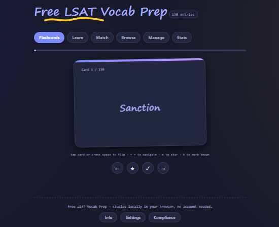

# Free LSAT Vocab Prep

  

---
## Why I Built This

[Free LSAT Vocab Prep](https://lsat-vocab-project.vercel.app/) is a free Quizlet alternative designed to help LSAT students master advanced vocabulary, particularly vocabulary encountered in Reading Comprehension (RC) passages. My goal is to make LSAT prep more accessible by eliminating the cost barrier associated with existing vocabulary study tools!

## How I built this

I built this primarily with Claude, however I do have an educational background in IT, so I was able to manually add/remove certain features and troubleshoot minor bugs. The website is hosted for free with Vercel.

The vocabulary list was pulled from [this Quizlet set](https://quizlet.com/720938082/lsat-vocab-building-flash-cards/?funnelUUID=44971580-cde8-4d79-922a-1dfb3cc9701f). I am incredibly grateful to the original creator of the set for compiling together all of these words and their definitions.

## Core Features

- Flashcards with the ability to star and prioritize words, with keybinds
- A "Learn" mode that functions similarly to Quizlet's version. It also has confetti 😁 
- A "Match" mode
- A "Browse" section that shows an index of all words and their definitions
- A "Manage" section that allows you to add/remove words; has 130 words and their definitions by default
- A customizable "Test" mode
- User stats to track performance
- A settings panel for customizability
- GDPR compliance

If you experience any bugs (I have yet to encounter any), try opening the website in another browser.

## License

This project is licensed under the [MIT License](LICENSE).
